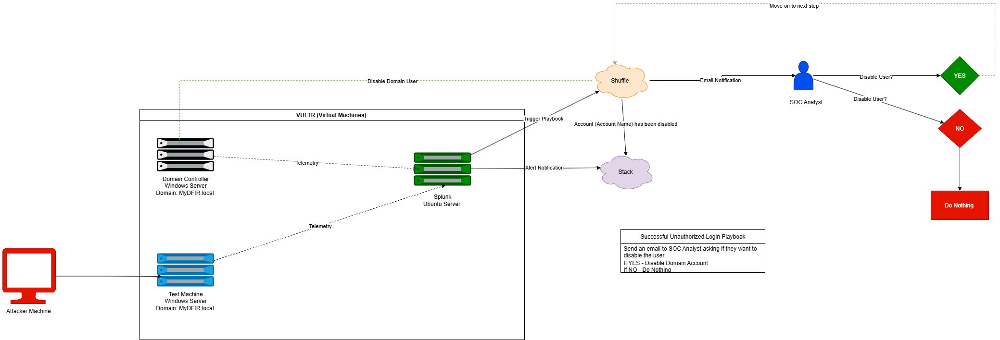
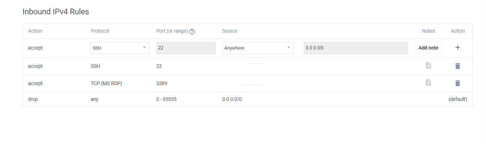
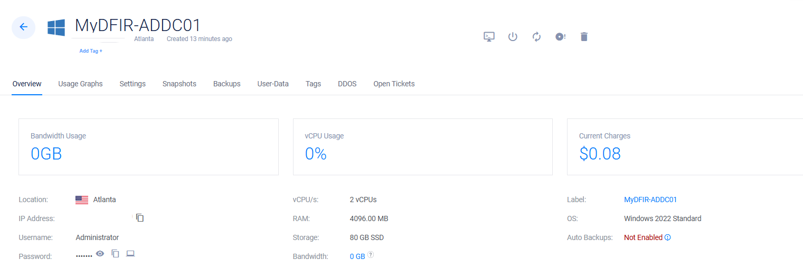
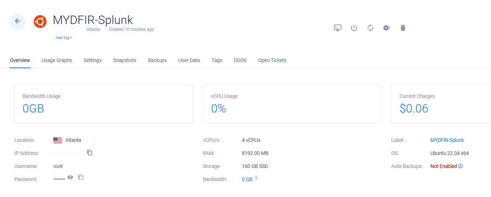
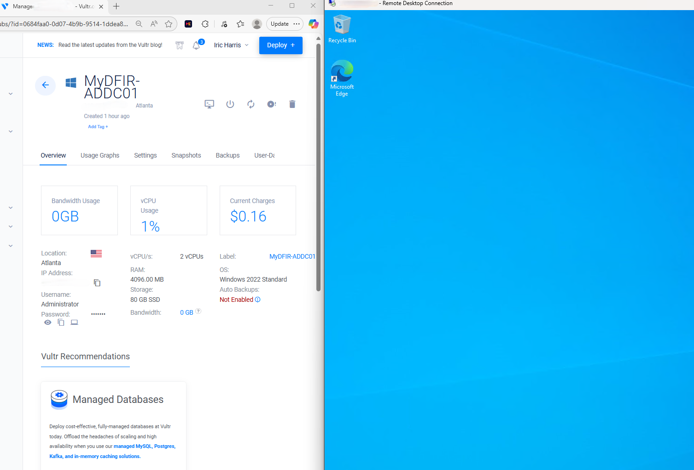
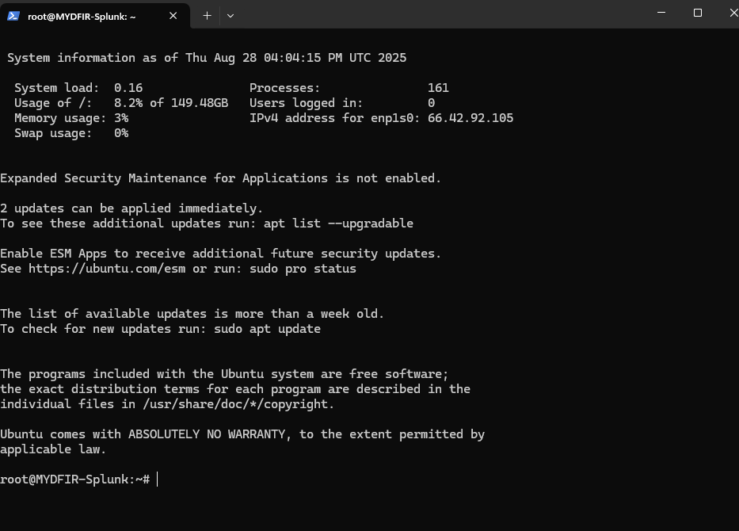

# 🌐 Vultr VPC Connectivity Lab — Windows DC + Windows Test + Ubuntu (Splunk)

This project documents how I deployed **three VMs on Vultr** (two Windows Server 2022 machines—one Domain Controller, one Test—and one **Ubuntu 22.04** server for **Splunk**), created a **restricted firewall group**, attached **VPC 2.0** networking, **fixed Windows NICs** to use the **VPC IPs**, and validated private connectivity by **pinging from Ubuntu to the Windows hosts**.

> 🔐 Public repo note: I redact/blur real IPs/tokens in screenshots. Use placeholders like `203.0.113.25` (public) and `10.0.0.x` (private VPC).

---

## 📌 Project Overview
- **Cloud**: Vultr (VPC 2.0)
- **VMs**:
  - **Windows Server 2022 — Domain Controller (DC)**
  - **Windows Server 2022 — Test workstation**
  - **Ubuntu 22.04 — Splunk host**
- **Goal**: Ensure all machines can communicate over **VPC private IPs**; verify from Ubuntu → Windows via `ping`
- **Security**: Vultr Firewall Group (locked to **my IP** for SSH/RDP)

---

## 🧱 Lab Architecture

| Component                  | Role                         | Access / Ports (from my IP only) |
|---------------------------|------------------------------|-----------------------------------|
| Windows Server 2022 (DC)  | AD/DC node (later)           | **3389/tcp** (RDP)                |
| Windows Server 2022 (Test)| Test workstation             | **3389/tcp** (RDP)                |
| Ubuntu 22.04 (Splunk)     | Splunk host & connectivity   | **22/tcp** (SSH)                  |
| VPC 2.0                   | Private overlay network      | VPC subnet (e.g., `10.0.10.0/24`) |
| Public Network            | Public IPs for admin only    | RDP/SSH restricted to my IP       |

📸 *Diagram placeholder*  


---

## ✅ Prerequisites
- Vultr account with **VPC 2.0** available
- RDP client (Windows: `mstsc`) and terminal for SSH
- Your **public IP** to lock down firewall rules

---

## 🔒 Firewall Group (Cloud Edge)
I created a new Vultr **Firewall Group** and assigned it to **all three servers**:

- **22/tcp (SSH)** → **Source: my IP**
- **3389/tcp (MS RDP)** → **Source: my IP**
- **Default** → deny everything else

📸 *Screenshot:*  


---

## 🚀 Steps (What I Actually Did)

### **Step 1 — Deploy Three VMs (Vultr)**
- **Windows Server 2022** (Domain Controller)
- **Windows Server 2022** (Test)
- **Ubuntu 22.04** (Splunk)
- For each VM:
  - **Enable VPC 2.0** (ensure a VPC network is selected)
  - **Assign Firewall Group** created above
  - Set a **hostname/label**
  - **Deploy**

📸 *Screenshots:*  
  
  
  

---

### **Step 2 — Access Servers**
- **Windows VMs**: Connected via **RDP** (public IP) from my workstation
- **Ubuntu VM**: Accessed via **SSH** (or web console)

📸 *Screenshots:*  
  


---

### **Step 3 — Test Connectivity from Ubuntu to Windows (Initial)**
From Ubuntu (Splunk host), I attempted to ping the Windows **Test** machine’s hostname/IP over VPC:

```bash
ping <windows-test-vpc-ip>
Result: Destination Host Unreachable (initial failure)
```

📸 Screenshot:

Step 4 — Inspect Windows Test NICs
On the Windows Test machine:

powershell
Copy code
```bash
ipconfig
```
Observation: Two adapters were present; the machine had a public IP but not the expected VPC IP.

📸 Screenshot:

Step 5 — Fix Windows Test NIC to Use VPC IP (Manual IPv4)
Windows → Network & Internet Settings → Adapter Options → (VPC NIC) → Properties → IPv4

Switched from Automatic (DHCP) to Manual

Set:

IP address: <your VPC IP> (e.g., 10.0.10.21)

Subnet mask: <your VPC mask> (e.g., 255.255.255.0)

(Gateway/DNS optional for intra-VPC ping; set if you need routed access)

Saved settings

📸 Screenshots:


Step 6 — Re-test from Ubuntu to Windows Test
Back on Ubuntu:

bash
Copy code
ping <windows-test-vpc-ip>
Result: Successful ping replies over the VPC network.

📸 Screenshot:

Step 7 — Apply the Same Fix on the Domain Controller
Repeated Step 5 for the Windows DC node:

Set the VPC IPv4 config on the correct NIC (manual IP + subnet)

Verified with ipconfig

📸 Screenshots:


Step 8 — Validate VPC Connectivity to DC
From Ubuntu (or the Windows Test box), ping the Domain Controller’s VPC IP:

bash
Copy code
ping <windows-dc-vpc-ip>
Result: Successful replies over VPC.

📸 Screenshot:

🧩 Troubleshooting Notes
Symptom	Likely Cause	Fix
Destination Host Unreachable	Windows VM on public NIC only	Set the VPC NIC to a manual IPv4 in the VPC subnet
Can’t RDP/SSH after FW change	Cloud FW too strict	Ensure 3389/22 allowed from your IP in the Vultr FW Group
Wrong adapter edited	Multiple NICs (public + VPC)	Identify the VPC adapter (no default gateway; private range)
No name resolution on VPC	No DNS for private subnet	Use VPC IPs directly or stand up DNS later (e.g., on DC)
Need routed internet from VPC NIC	Missing gateway/DNS on VPC NIC	Add gateway/DNS if required by your design

📸 Screenshot Checklist
pgsql
Copy code
/screenshots/
├── vpc-connectivity-diagram.png
├── vultr-deploy-windows.png
├── vultr-deploy-ubuntu.png
├── vultr-attach-vpc-fw.png
├── vultr-firewall-group.png
├── rdp-windows.png
├── ssh-ubuntu.png
├── ubuntu-ping-unreachable.png
├── windows-ipconfig-before.png
├── windows-ipv4-manual.png
├── windows-ipconfig-after.png
├── ubuntu-ping-success.png
├── windows-dc-ipv4-manual.png
├── windows-dc-ipconfig-after.png
└── ping-dc-success.png
🔐 Redaction tip: blur/replace real public IPs with 203.0.113.25 and private IPs with 10.0.0.x.

🏁 Results
Deployed 3 VMs (Windows DC, Windows Test, Ubuntu/Splunk) with VPC 2.0

Applied a locked-down Vultr Firewall Group (SSH/RDP from my IP only)

Fixed Windows NICs to use VPC IPs (manual IPv4) on the correct adapter

Verified private connectivity (Ubuntu → Windows Test & DC) over the VPC network
